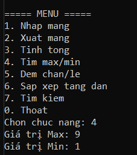
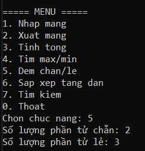
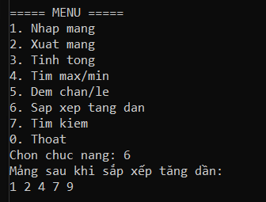
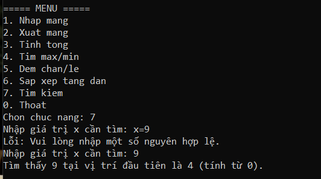

# Báo Cáo Kết Quả Thực Hành - Lab 02: Quản Lý Mảng 1 Chiều

Dưới đây là các minh chứng chạy chương trình cho từng chức năng trong menu hệ thống, sử dụng bộ dữ liệu kiểm thử (test case): `4, 1, 9, 2, 7`.

---

### 1. Minh chứng: Khởi động và Nhập mảng

**Mô tả:** 
Chương trình hiển thị menu điều hướng các chức năng rõ ràng. Khi người dùng chọn chức năng `1. Nhap mang`, chương trình tiếp nhận thành công số lượng phần tử và ghi nhận lần lượt các giá trị đầu vào là `4, 1, 9, 2, 7`. Dữ liệu được cấp phát và lưu trữ an toàn vào bộ nhớ.

---

### 2. Minh chứng: Xuất mảng

**Mô tả:** 
Khi chọn chức năng `2. Xuat mang`, chương trình gọi phương thức xuất và in toàn bộ các phần tử của mảng ra màn hình trên cùng một dòng. Kết quả hiển thị chính xác bộ dữ liệu `4 1 9 2 7` đã được khởi tạo ở bước 1, chứng minh dữ liệu không bị thất thoát.

---

### 3. Minh chứng: Tính tổng các phần tử

**Mô tả:** 
Lựa chọn chức năng `3. Tinh tong`, chương trình duyệt qua mảng và cộng dồn các giá trị. Kết quả trả về là `23` (tương đương 4 + 1 + 9 + 2 + 7), hoàn toàn trùng khớp với kết quả tính toán mong đợi của bài toán.

---

### 4. Minh chứng: Tìm giá trị Max / Min

**Mô tả:** 
Với chức năng `4. Tim max/min`, thuật toán tiến hành duyệt mảng và so sánh, sau đó trích xuất thành công giá trị lớn nhất (Max) là `9` cùng giá trị nhỏ nhất (Min) là `1`. 

---

### 5. Minh chứng: Đếm phần tử chẵn, lẻ

**Mô tả:** 
Chức năng `5. Dem chan/le` sử dụng toán tử chia lấy dư để phân loại. Kết quả chương trình đếm được chính xác có 2 phần tử chẵn (số 4, số 2) và 3 phần tử lẻ (số 1, số 9, số 7). 

---

### 6. Minh chứng: Sắp xếp mảng tăng dần

**Mô tả:** 
Khi gọi lệnh `6. Sap xep tang dan`, chương trình thao tác trực tiếp trên vùng nhớ của mảng ban đầu. Kết quả in ra dãy số mới là `1 2 4 7 9`, minh chứng cho việc mảng đã được sắp xếp lại theo đúng thứ tự tăng dần.

---

### 7. Minh chứng: Tìm kiếm phần tử & Bắt lỗi nhập liệu

**Mô tả:** 
Chức năng `7. Tim kiem` thể hiện hai ưu điểm về mặt logic:
1. **Bắt lỗi (Validation):** Khi cố tình nhập sai định dạng (chữ `x=9`), chương trình không bị văng lỗi (crash) mà hiển thị cảnh báo yêu cầu nhập lại số nguyên hợp lệ.
2. **Tìm kiếm:** Nhập giá trị cần tìm là `9`. Do mảng đã được sắp xếp tăng dần ở bước 6 (thành `1 2 4 7 9`), phần tử số 9 hiện đang nằm ở index số 4. Chương trình trả về vị trí `4` hoàn toàn chuẩn xác.

---

### 8. Minh chứng: Tìm kiếm phần tử (Trường hợp không tồn tại)

**Mô tả:** 
Tiếp tục thử nghiệm tính năng tìm kiếm với một giá trị không có thực trong mảng (ví dụ: `x = 5`). Thuật toán duyệt qua toàn bộ mảng và in ra thông báo "Không tìm thấy" theo đúng chuẩn kịch bản kiểm thử ngoại lệ.
