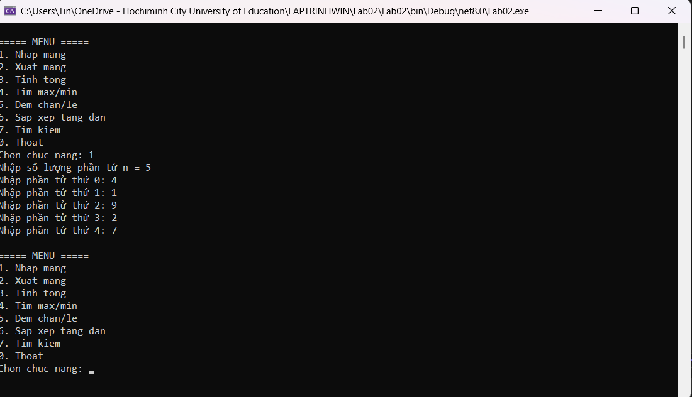
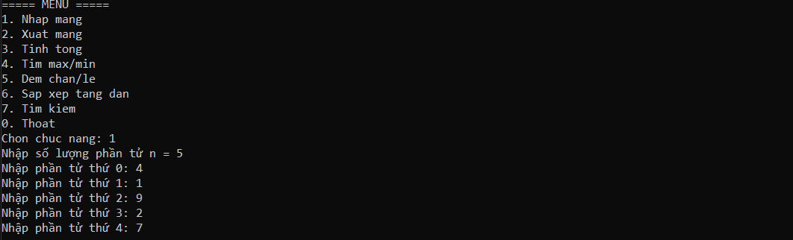
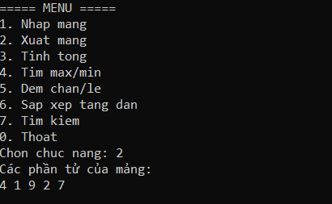
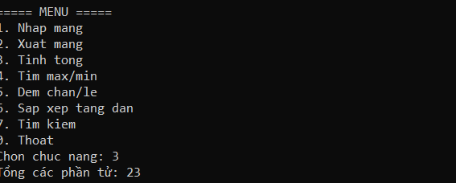

### 1. Minh chứng chạy chương trình: Chức năng nhập mảng

**Mô tả:** Chương trình hiển thị menu điều hướng rõ ràng. Khi chọn chức năng `1. Nhap mang`, chương trình tiếp nhận thành công số lượng phần tử n = 5 và ghi nhận lần lượt các giá trị đầu vào là `4, 1, 9, 2, 7` đúng theo bộ dữ liệu kiểm thử.

---

### 2. Minh chứng chạy chương trình: Chức năng xuất mảng

**Mô tả:** Sau khi lựa chọn chức năng `2. Xuat mang`, chương trình đã gọi phương thức xuất và in toàn bộ các phần tử của mảng ra màn hình trên cùng một dòng. Kết quả hiển thị chính xác bộ dữ liệu `4 1 9 2 7` đã được khởi tạo.

---

### 3. Minh chứng chạy chương trình: Chức năng tính tổng

**Mô tả:** Chương trình duyệt qua mảng và tính toán thành công tổng các phần tử. Kết quả trả về là `23`, hoàn toàn trùng khớp với kết quả mong đợi.

---

### 4. Minh chứng chạy chương trình: Tìm giá trị lớn nhất và nhỏ nhất

**Mô tả:** Chương trình duyệt qua mảng dữ liệu và trích xuất thành công giá trị lớn nhất (Max) là `9` cùng giá trị nhỏ nhất (Min) là `1`.
