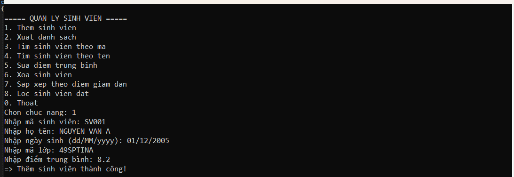
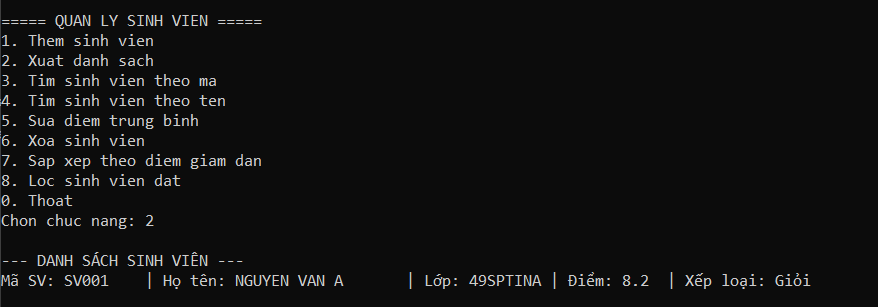
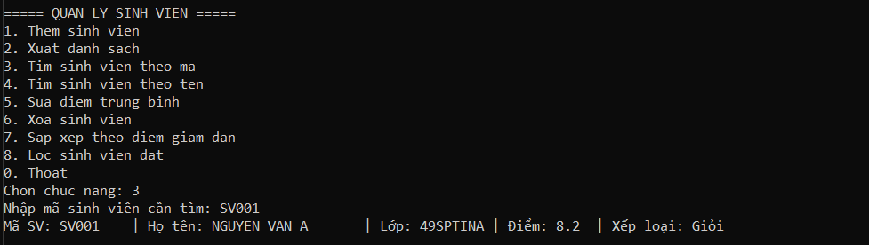
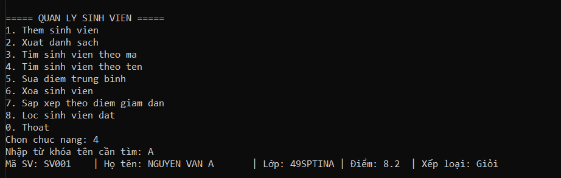
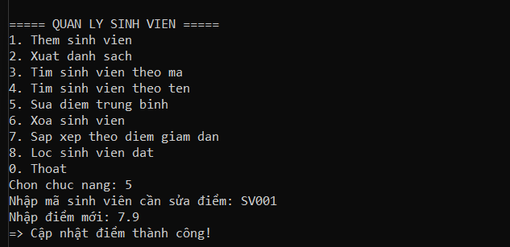
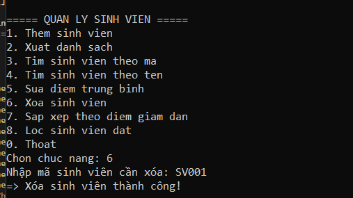
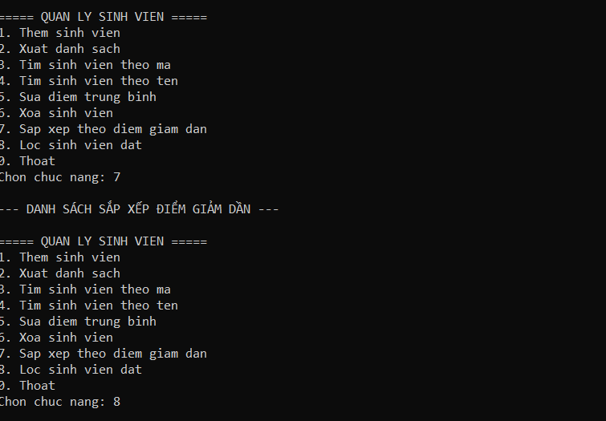
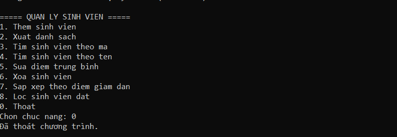

# Báo Cáo Kết Quả Thực Hành - Lab 03: Quản Lý Sinh Viên (OOP)

Dưới đây là các minh chứng chạy chương trình quản lý sinh viên, thể hiện việc áp dụng thành công phương pháp Lập trình hướng đối tượng (OOP), thao tác dữ liệu trên `List<SinhVien>` và sử dụng kỹ thuật truy vấn LINQ.

---

### 1. Chức năng: Thêm sinh viên

**Mô tả:** Người dùng chọn chức năng `1` và tiến hành nhập liệu[cite: 19]. Chương trình đã khởi tạo và lưu trữ thành công sinh viên mang mã `SV001` (NGUYEN VAN A, sinh ngày 01/12/2005, lớp 49SPTINA) với điểm trung bình là 8.2[cite: 19]. Các cơ chế xác thực dữ liệu (validation) hoạt động ổn định.

---

### 2. Chức năng: Xuất danh sách

**Mô tả:** Khi gọi lệnh `2`, hệ thống duyệt qua danh sách (List) và in ra màn hình thông tin sinh viên vừa nhập[cite: 20]. Đặc biệt, phương thức `XepLoai()` của lớp `SinhVien` đã tự động tính toán và trả về kết quả xếp loại "Giỏi" dựa trên mức điểm 8.2 một cách chính xác[cite: 20].

---

### 3. Chức năng: Tìm sinh viên theo mã

**Mô tả:** Chức năng `3` được thực thi với mã truy vấn là `SV001`[cite: 21]. Thuật toán tìm kiếm (sử dụng `FirstOrDefault`) đã trích xuất đúng đối tượng và hiển thị đầy đủ thông tin lên màn hình Console[cite: 21].

---

### 4. Chức năng: Tìm sinh viên theo tên

**Mô tả:** Lựa chọn chức năng `4` và nhập từ khóa `A`[cite: 22]. Bằng việc sử dụng LINQ để quét các chuỗi chứa từ khóa, chương trình đã định vị chính xác và trả về kết quả là sinh viên "NGUYEN VAN A"[cite: 22].

---

### 5. Chức năng: Sửa điểm trung bình

**Mô tả:** Chức năng `5` cho phép can thiệp vào thuộc tính của đối tượng đã lưu[cite: 23]. Thông qua mã `SV001`, hệ thống đã ghi đè thành công giá trị điểm trung bình cũ thành giá trị mới là `7.9` và in ra thông báo xác nhận[cite: 23].

---

### 6. Chức năng: Xóa sinh viên

**Mô tả:** Chọn chức năng `6` và nhập mã `SV001`[cite: 24]. Chương trình tìm thấy đối tượng tương ứng và thực hiện lệnh `Remove` để gỡ bỏ hoàn toàn sinh viên này khỏi bộ nhớ (List), kèm theo thông báo thành công[cite: 24].

---

### 7. Chức năng: Sắp xếp và Lọc sinh viên

**Mô tả:** Hình ảnh minh chứng việc gọi lệnh `7` (Sắp xếp theo điểm giảm dần) và nhập lệnh `8` (Lọc sinh viên đạt)[cite: 25]. Do đối tượng duy nhất đã bị xóa ở thao tác số 6, hệ thống xử lý an toàn danh sách rỗng, không in ra dữ liệu thừa và không gây lỗi (crash) chương trình[cite: 25].

---

### 8. Chức năng: Thoát chương trình

**Mô tả:** Người dùng chọn phím `0`[cite: 26]. Vòng lặp điều khiển `do-while` kết thúc an toàn, xuất thông báo "Đã thoát chương trình" và giải phóng hoàn toàn tài nguyên[cite: 26].