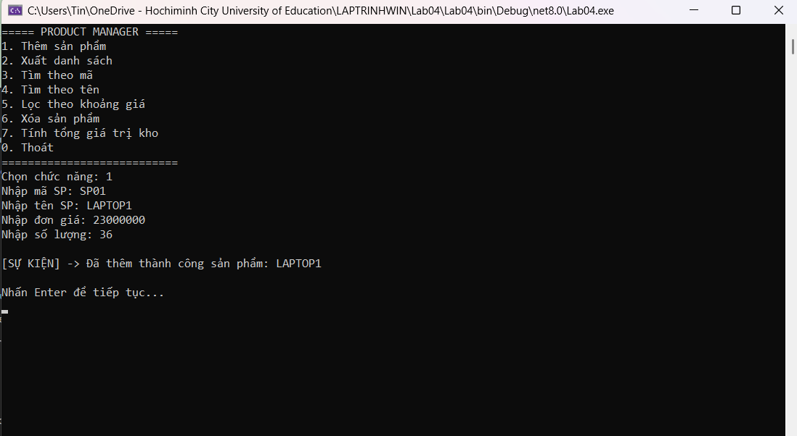
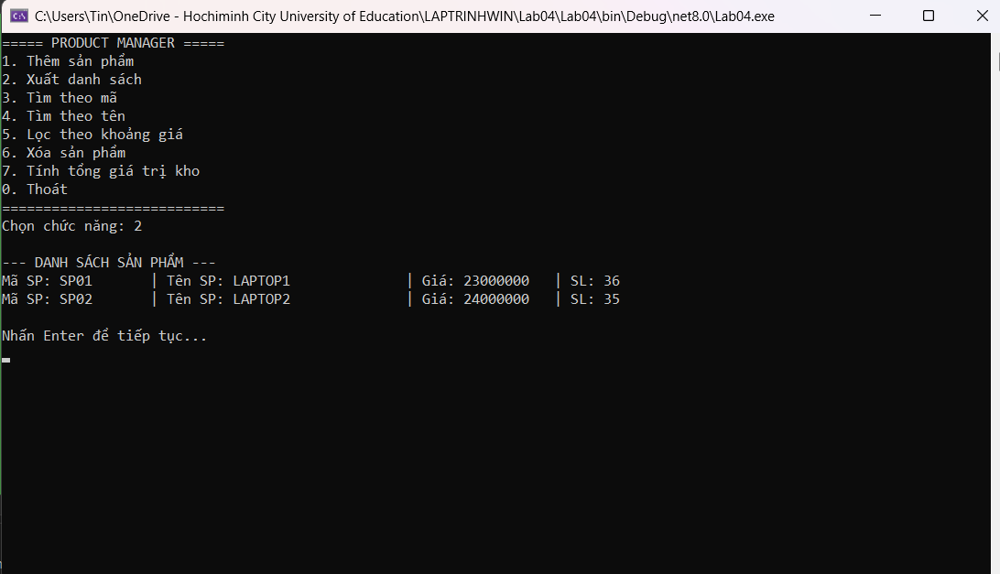
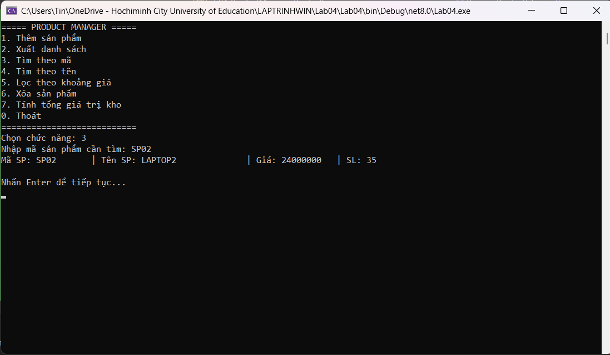
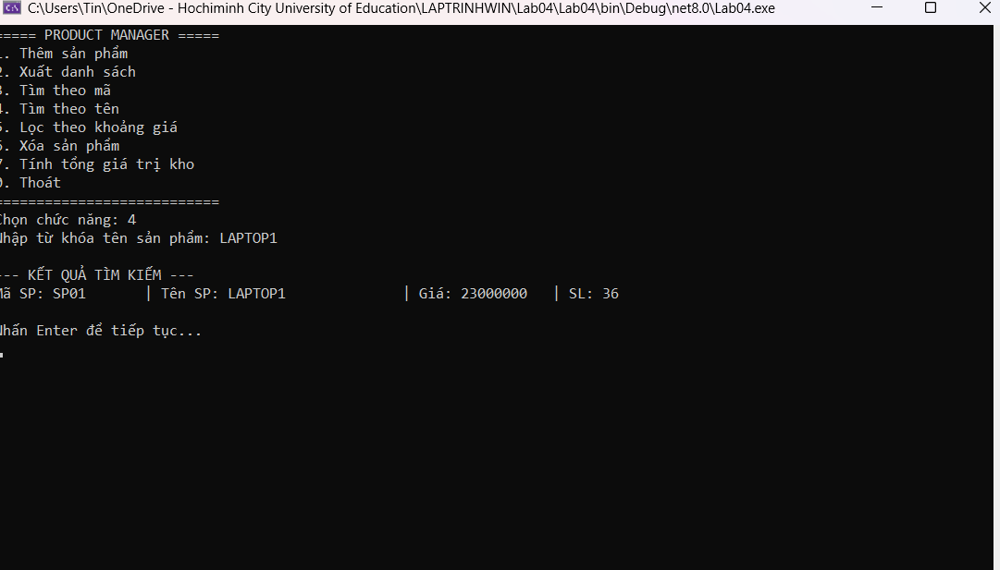
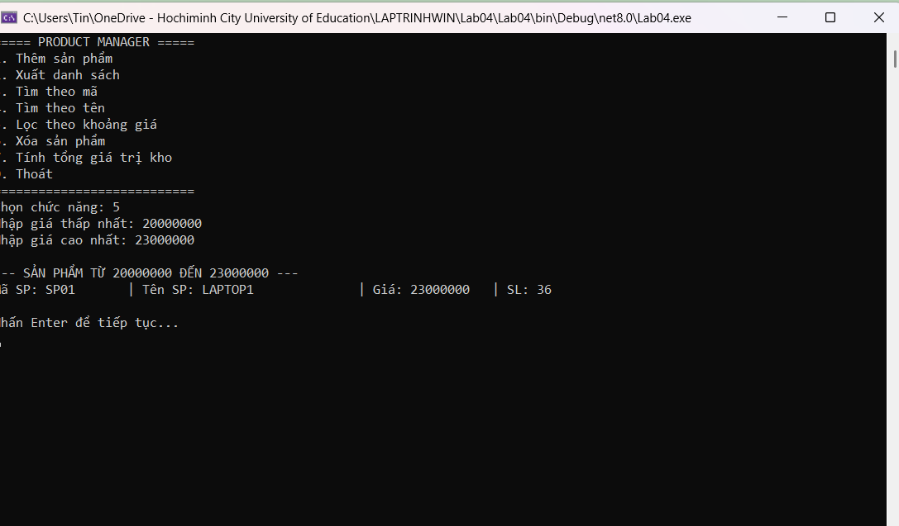
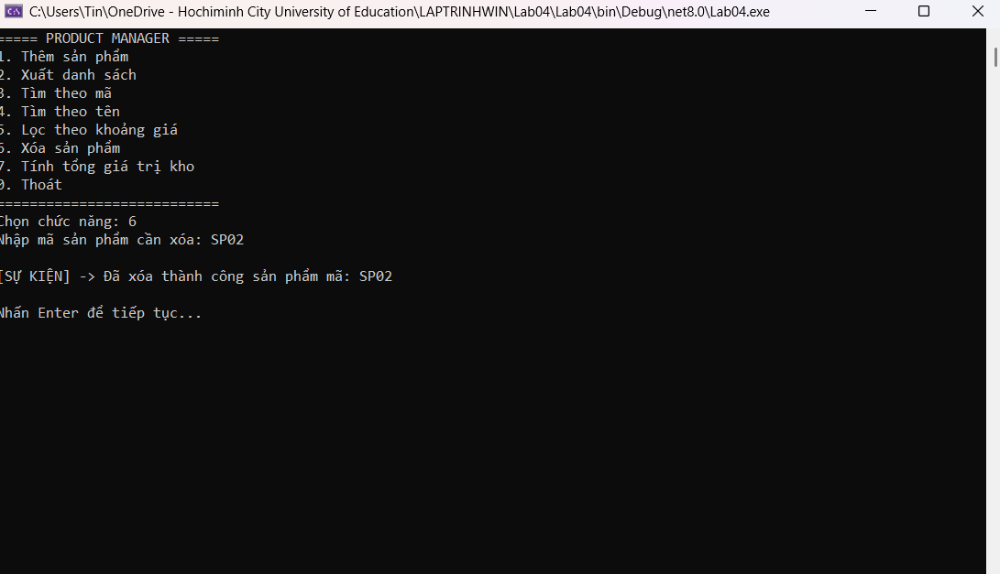
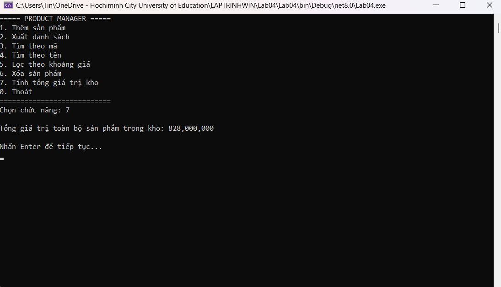
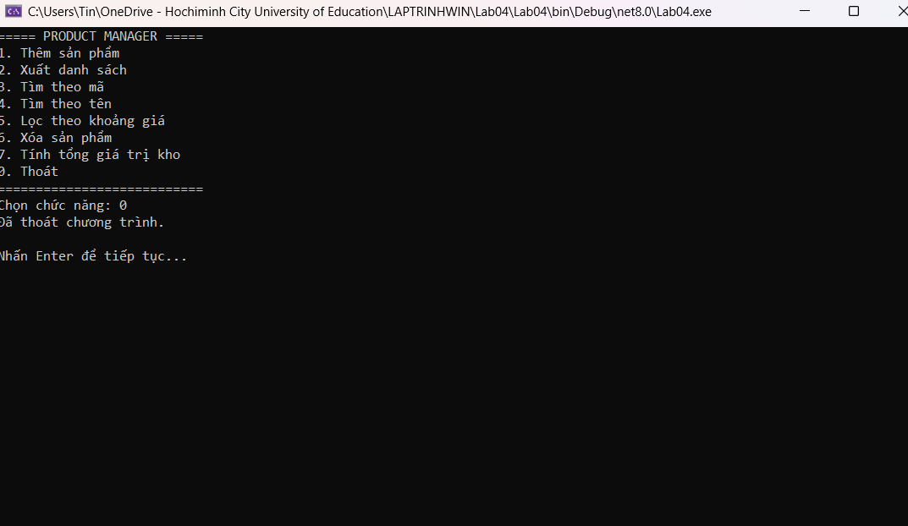

##  Hình ảnh Demo Chức năng Lab04

### 1. Thêm sản phẩm mới
Khi người dùng chọn chức năng `1`, chương trình yêu cầu nhập lần lượt các thông tin: Mã sản phẩm, Tên sản phẩm, Đơn giá và Số lượng. Sau khi nhập hợp lệ, một sự kiện (Event) sẽ được kích hoạt để thông báo việc thêm thành công.

*Ví dụ: Thêm thành công sản phẩm LAPTOP1 với mã SP01, giá 23,000,000 và số lượng 36.*

### 2. Xuất danh sách sản phẩm
Chọn chức năng `2` để hiển thị toàn bộ sản phẩm đang có trong kho. Dữ liệu được định dạng căn lề thẳng hàng, giúp người dùng dễ dàng theo dõi thông tin (Mã, Tên, Giá, Số lượng).

*Danh sách hiển thị 2 sản phẩm đã thêm là SP01 (LAPTOP1) và SP02 (LAPTOP2).*

### 3. Tìm sản phẩm theo mã
Chức năng `3` cho phép người dùng truy xuất nhanh một sản phẩm thông qua Mã sản phẩm duy nhất. Nếu tìm thấy, chương trình sẽ in toàn bộ thông tin của sản phẩm đó ra màn hình.

*Kết quả trả về chính xác thông tin của sản phẩm mang mã SP02.*

### 4. Tìm sản phẩm theo tên
Chức năng `4` (sử dụng `Func<Product, bool>`) hỗ trợ tìm kiếm linh hoạt theo tên sản phẩm. Người dùng chỉ cần nhập từ khóa, chương trình sẽ trả về danh sách các sản phẩm có tên khớp với từ khóa đó.

*Tìm kiếm với từ khóa "LAPTOP1" trả về kết quả tương ứng.*

### 5. Lọc sản phẩm theo khoảng giá
Chức năng `5` minh họa việc sử dụng Generic và Delegate để lọc danh sách. Người dùng nhập vào mức giá thấp nhất và cao nhất; chương trình sẽ truy xuất các sản phẩm nằm trong khoảng giá này.

*Lọc các sản phẩm có giá từ 20,000,000 đến 23,000,000 đồng.*

### 6. Xóa sản phẩm
Chọn chức năng `6` và nhập mã sản phẩm cần xóa. Nếu mã hợp lệ và sản phẩm tồn tại, chương trình sẽ tiến hành xóa khỏi kho dữ liệu, đồng thời kích hoạt Event thông báo ra màn hình.

*Thông báo sự kiện xóa thành công sản phẩm mang mã SP02.*

### 7. Tính tổng giá trị kho
Chức năng `7` duyệt qua toàn bộ danh sách hiện tại (đã cập nhật sau khi xóa/thêm) và tính toán tổng giá trị bằng công thức: `Tổng = Đơn giá * Số lượng`. Kết quả được định dạng có dấu phẩy phân cách hàng nghìn.

*Tổng giá trị kho hiện tại là 828,000,000 đồng.*

### 8. Thoát chương trình
Chọn chức năng `0` để kết thúc vòng lặp chương trình và thoát ứng dụng một cách an toàn.

