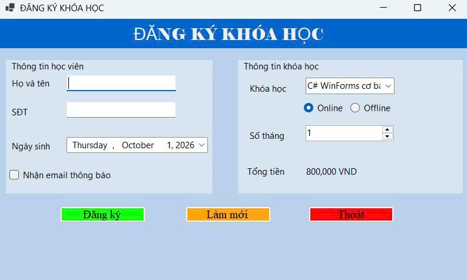
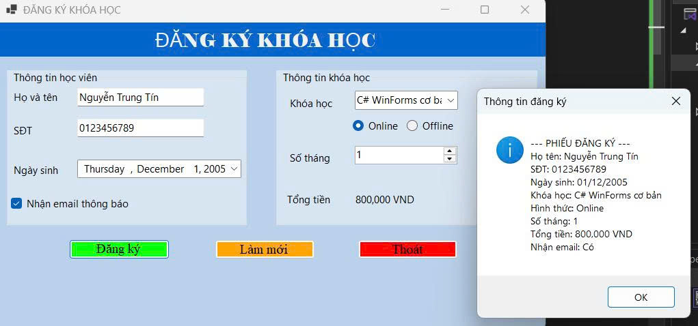
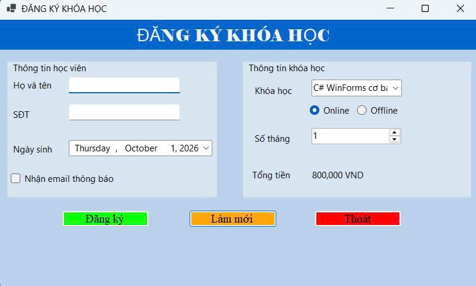
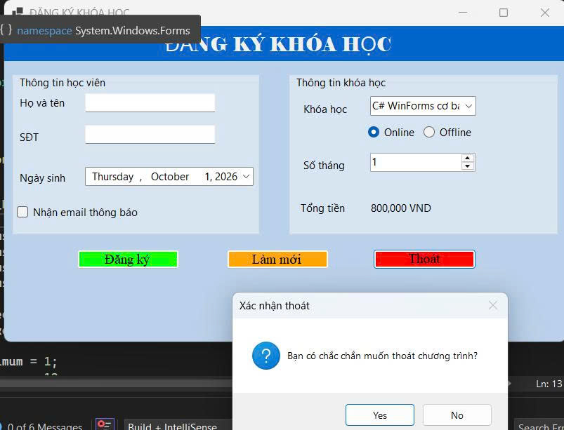

## Hình ảnh minh họa chức năng ứng dụng

**1. Giao diện mặc định khi Form Load**
Trạng thái khởi chạy ứng dụng (Form Load)Nhóm Thông tin học viên: Các ô nhập liệu "Họ và tên" và "SĐT" hiển thị trống, chờ người dùng thao tác. Mục "Ngày sinh" tự động nạp ngày hệ thống hiện tại (Thursday, October 1, 2026), và ô kiểm "Nhận email thông báo" chưa được đánh dấu.   Nhóm Thông tin khóa học: Hệ thống tự động chọn sẵn khóa học đầu tiên là "C# WinForms cơ bản", thiết lập hình thức học "Online", và đặt "Số tháng" tối thiểu là 1.   Xử lý học phí: Dựa vào các thông số mặc định, nhãn "Tổng tiền" tự động tính toán và hiển thị ngay kết quả "800,000 VND" mà không cần tác động thêm.  

**2. Chức năng Đăng ký**
Dữ liệu đầu vào: Giao diện thể hiện trạng thái đã được điền đầy đủ dữ liệu bao gồm tên "Nguyễn Trung Tín", số điện thoại "0123456789", ngày sinh "December 1, 2005" và ô nhận email đã được tích chọn.   Hộp thoại kết quả: Khi nhấn nút "Đăng ký" màu xanh lá, ứng dụng hiển thị một MessageBox mang tiêu đề "Thông tin đăng ký" kèm theo biểu tượng chữ "i" (Information icon).   Chi tiết phiếu đăng ký: Hộp thoại tổng hợp và hiển thị chính xác toàn bộ dữ liệu người dùng đã chọn dưới dạng danh sách "--- PHIẾU ĐĂNG KÝ ---", bao gồm các trường: Họ tên, SĐT, Ngày sinh (được định dạng thành 01/12/2005), Khóa học, Hình thức, Số tháng, Tổng tiền và trạng thái Nhận email (Có). 

**3. Chức năng Làm mới**
Khôi phục vùng học viên: Sau khi nhấn nút "Làm mới" màu cam, nội dung tại "Họ và tên" và "SĐT" bị xóa trắng. Ô chọn ngày sinh quay trở lại ngày hiện hành (October 1, 2026) và ô kiểm nhận email bị hủy chọn.   Khôi phục vùng khóa học: Các trường lựa chọn được trả về trạng thái mặc định: "C# WinForms cơ bản", "Online", 1 tháng và mức tiền 800,000 VND.   Điều hướng UI/UX: Ứng dụng tự động điều hướng con trỏ (focus) về lại ô TextBox "Họ và tên", biểu hiện qua đường viền chỉ báo màu xanh dương nổi bật dưới ô nhập liệu, giúp thao tác đăng ký người mới được liền mạch.   

**4. Chức năng Thoát**
Kích hoạt cảnh báo: Thay vì đóng Form ngay lập tức, việc nhấn vào nút "Thoát" màu đỏ sẽ gọi ra một MessageBox mang tiêu đề "Xác nhận thoát".   Nội dung xác nhận: Hộp thoại hiển thị thông điệp "Bạn có chắc chắn muốn thoát chương trình?" cùng với biểu tượng dấu chấm hỏi (Question icon).   Cơ chế phòng ngừa: Hệ thống cung cấp hai lựa chọn "Yes" và "No", buộc người dùng phải xác nhận ý định (chọn Yes) thì phần mềm mới chính thức chấm dứt hoạt động. 
