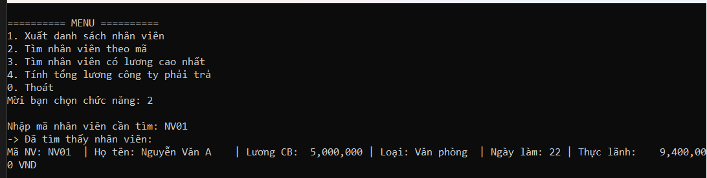
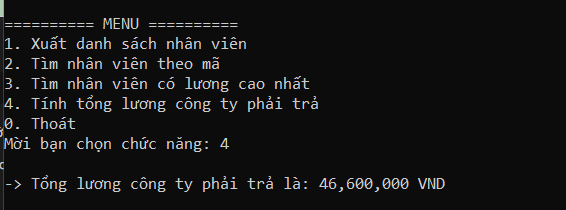
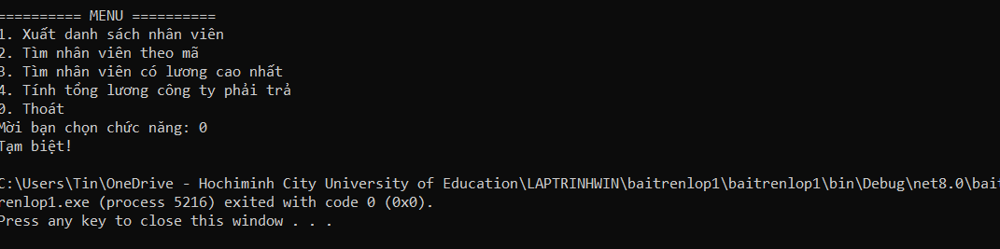

### 📸 Hình ảnh Demo Chương trình & Chi tiết chức năng

**1. Chức năng Xuất danh sách nhân viên (Lựa chọn 1)**

> **Mô tả:** Màn hình hiển thị Menu chính của chương trình và kết quả khi người dùng chọn phím `1`. Danh sách in ra 5 nhân viên mẫu thuộc 3 phân loại khác nhau: Nhân viên Văn phòng, Nhân viên Kinh doanh và Nhân viên Thời vụ (Bonus). Tính đa hình (Polymorphism) được thể hiện rõ ràng khi mỗi đối tượng tự động hiển thị đúng các trường dữ liệu đặc thù của mình (Ngày làm, Doanh số, Giờ làm) và công thức tính "Thực lãnh" tương ứng.

**2. Chức năng Tìm nhân viên theo mã (Lựa chọn 2)**

> **Mô tả:** Minh họa thao tác tìm kiếm nhân viên. Khi người dùng nhập từ khóa là mã nhân viên (ví dụ: `NV01`), chương trình sử dụng LINQ để duyệt danh sách và trả về chính xác, đầy đủ thông tin của nhân viên "Nguyễn Văn A". Nếu không tìm thấy, hệ thống cũng sẽ có thông báo phản hồi tương ứng.

**3. Chức năng Tìm nhân viên có lương cao nhất (Lựa chọn 3)**

> **Mô tả:** Thể hiện kết quả của thuật toán tìm kiếm mức lương cao nhất. Bằng cách gọi phương thức `TinhLuong()` đã được ghi đè (override) trên từng object, chương trình so sánh và tìm ra nhân viên "Phạm Thị D" (mã KD02) có mức lương thực lãnh cao nhất là `14,200,000 VND` mà hoàn toàn không cần sử dụng cấu trúc rẽ nhánh `if/switch` để kiểm tra kiểu nhân viên.

**4. Chức năng Tính tổng lương công ty phải trả (Lựa chọn 4)**

> **Mô tả:** Chức năng thống kê tổng chi phí lương của doanh nghiệp. Hàm `Sum()` duyệt qua toàn bộ danh sách `List<NhanVien>`, kích hoạt tính đa hình để cộng dồn chính xác mức thực lãnh của từng cá nhân, cho ra kết quả tổng cục là `46,600,000 VND`.

**5. Chức năng Thoát chương trình (Lựa chọn 0)**

> **Mô tả:** Trạng thái khi người dùng chọn phím `0` để kết thúc vòng lặp `do-while`. Giao diện hiển thị lời chào "Tạm biệt!" và tiến trình Console đóng lại một cách an toàn, giải phóng tài nguyên hệ thống (exited with code 0).
